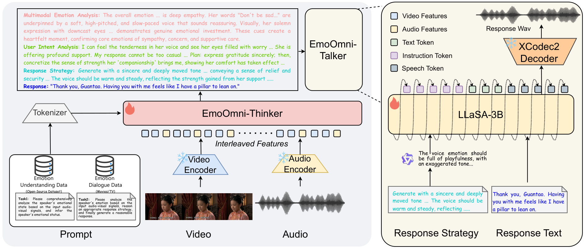
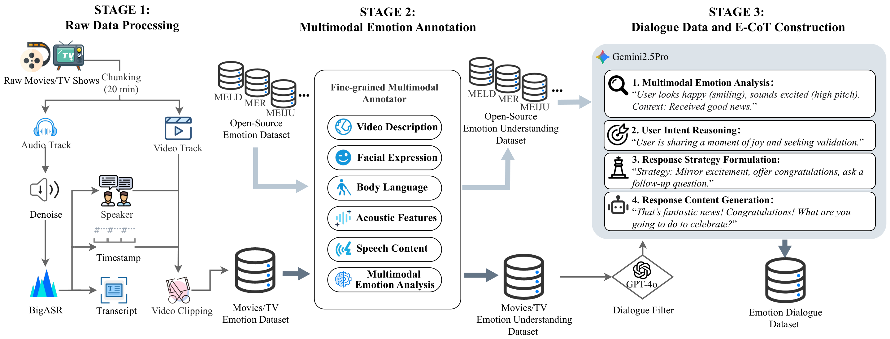

<h1 align="center">EmoOmni</h1>
<p align="center"><b>Bridging Emotional Understanding and Expression<br/>in Omni-Modal LLMs</b></p>

<p align="center">
  <a href="https://18281818221.github.io/EmoOmni/"></a>
  <a href="#-quick-usage-workflow"></a>
  <a href="#-citation"></a>
  <a href="#-license"></a>
</p>

<p align="center">
  
  <br/>
  <em>Figure 1. EmoOmni decomposes multimodal emotional dialogue as a <b>Perception – Reasoning – Expression</b> pipeline
  built from <b>EmoOmni-Thinker</b> (multimodal perception + E-CoT reasoning) and <b>EmoOmni-Talker</b>
  (instruction-guided expressive speech synthesis).</em>
</p>

---

## 📋 TL;DR

**EmoOmni** is an Omni-Modal LLM framework for **Multimodal Emotional Dialogue (MED)**.
It introduces an explicit **Emotional Chain-of-Thought (E-CoT)** that bridges perception
and expression, treating the reasoning output as an explicit emotion instruction that
guides the talker. With only **7B** parameters, EmoOmni achieves performance comparable
to 30B-scale Omni-LLMs on our proposed MED benchmark.

- 🧠 **EmoOmni-Thinker** — multimodal perception + four-stage E-CoT reasoning
  (*multimodal emotion analysis · user intent recognition · response strategy planning · textual response content*).
- 🎙️ **EmoOmni-Talker** — instruction-guided TTS built on VoiceSculptor;
  synthesizes emotionally expressive speech under high-level emotion instructions distilled from the response strategy.
- 🧪 **EmoOmniPipe** — a three-stage pipeline that annotates emotionally rich dialogues from movies and TV series.
- 📊 **EmoOmniEval** — a benchmark covering multimodal emotional comprehension and MED,
  with three evaluation settings: Video-to-Speech (VS), Video-to-Text Response (VT), and Instruction Following (IF).

## 🎧 Online Demo

Sample showcase: we provide a static demo page at
**[https://18281818221.github.io/EmoOmni/](https://18281818221.github.io/EmoOmni/)**
that presents 7 dialogue examples generated by EmoOmni. Each example includes the
video input, the four-stage E-CoT output produced by EmoOmni-Thinker, and the
expressive speech synthesized by EmoOmni-Talker.

> The demo is a static showcase for viewing outputs only; interactive inference is not available on this page.

## 📰 News

- **2026-07** &nbsp; 🎉 EmoOmni preprint released; code, evaluation scripts, and demo samples are now open-sourced.
- **2026-07** &nbsp; 📁 Test sets of **EmoOmniEval** (MELD & CH-SIMSv2 splits) released under `EmoOmniEval/testsets/`.

## 🧭 Framework

EmoOmni explicitly decomposes MED as a **Perception – Reasoning – Expression** pipeline
(see Figure 1). Given audio-visual inputs, the **Thinker** first extracts fine-grained
acoustic and visual signals, and then produces the **Emotional Chain-of-Thought (E-CoT)**
comprising four components:

1. **Multimodal Emotion Analysis** — perceived affective signals across modalities.
2. **User Intent Recognition** — the underlying communicative intent behind the input.
3. **Response Strategy Planning** — a plan describing *how* to respond emotionally.
4. **Textual Response Content** — the concrete textual reply.

The response strategy is then processed by a lightweight language model into an explicit
**emotion instruction**, which conditions **EmoOmni-Talker** (built on VoiceSculptor)
during autoregressive speech generation. This explicit reasoning-to-instruction linkage
avoids the loss of emotional detail typical of implicit Thinker–Talker connections.

## 🧪 Data Pipeline (EmoOmniPipe)

<p align="center">
  
  <br/>
  <em>Figure 2. <b>EmoOmniPipe</b>: (1) raw video/audio cleaning and speaker-aware segmentation,
  (2) fine-grained multimodal annotation (facial expression, body language, acoustic features,
  speech content, and holistic emotion analysis), and (3) E-CoT construction and dialogue
  filtering, producing high-quality training data for the entire Perception–Reasoning–Expression pipeline.</em>
</p>

## 📁 Repository Layout

```
EmoOmni/
├── assets/                 # Figures used in this README (PDF + PNG)
├── docs/                   # Static demo page (served via GitHub Pages)
│   ├── index.html
│   └── media/              # 7 video/audio samples showcased in the demo
├── EmoOmniModel/           # Model training / inference (Qwen2.5-Omni Swift Framework)
├── EmoOmniPipeline/        # Data pipeline (EmoOmniPipe, 3 stages)
├── EmoOmniEval/            # Evaluation scripts + open-sourced test sets
└── README.md
```

The repository includes **4 core directories**, each mapping to a functional module in the paper:

### 1. `EmoOmniModel/` — Model Training / Inference
* **Corresponds to:** the model training/inference module of the paper.
* **Framework:** built on the **Qwen2.5-Omni Swift** framework.
* **Note:** this directory does **not** ship model weights (which rely on Qwen2.5-Omni base weights);
  it only stores framework launch scripts:
  * `swift_sft_stage2.sh` — Stage-2 supervised fine-tuning launch script (supports LoRA / full FT).
  * `swift_training_requirement.txt` — environment/dependency reference matching the Swift framework.

### 2. `EmoOmniPipeline/` — Data Pipeline (EmoOmniPipe)
* **Corresponds to:** the **EmoOmniPipe** data pipeline (Figure 2).
* **Stage 1** — `Stage1_BigASR_API/`, `Stage1_Denoise_MelBanRoformer/`: raw audio denoising and ASR-based segmentation.
* **Stage 2** — `Stage2_Anootation/`: multimodal annotation via SABER-LLM (Swift-based inference).
* **Stage 3** — `Stage3_Dialogue/`: E-CoT construction (`E-CoT.py`), instruction distillation (`Ecot_to_Instruction.py`),
  dialogue-level semantic (`Dialogue_Semantic_filter.py`) and toxicity (`Dialogue_toxic_filter.py`) filtering.

### 3. `EmoOmniEval/` — Evaluation
* **Corresponds to:** the model evaluation module of the paper.
* **`evalution/`** — evaluation scripts covering:
  * `Eval_VS.py` — Video-to-Speech end-to-end evaluation.
  * `Eval_VT_EA____VT_RES.py` — Video-to-Text: Emotion Analysis (VT-EA) & Response Emotional Strategy (VT-RES).
  * `Eval_VT_RC.py` — Video-to-Text Response Content evaluation.
  * `Eval_IF.py` — Instruction Following on the synthesized speech.
  * `cal_wer.py`, `UTMOS.py`, `UTMOSv2/` — WER / speech-quality auxiliary metrics.
* **`testsets/`** — open-sourced test-set splits: `MELD_test_open_sourced.jsonl`,
  `CH_SIMSv2_test_open_sourced.jsonl`.

### 4. `MultimodalEmotionalDialogueData/` — Training Data *(release forthcoming)*
* **Corresponds to:** the **Multimodal Emotional Dialogue** dataset of the paper.
* **Content:** `.jsonl` files used for model training. A small sample is included here;
  the full dataset will be released on Hugging Face soon.

## 🚀 Quick Usage Workflow

1. **Prepare data.** Obtain the preprocessed dataset (or use your own dialogue data
   processed through **`EmoOmniPipeline/`**).
2. **Train the model.** Enter `EmoOmniModel/` and launch training via the Swift framework:
   ```bash
   bash EmoOmniModel/swift_sft_stage2.sh
   ```
3. **Run inference.** Use the trained checkpoint to generate end-to-end multimodal
   emotional dialogue responses.
4. **Evaluate.** Reproduce the paper's numbers with the scripts in `EmoOmniEval/evalution/`:
   ```bash
   python EmoOmniEval/evalution/Eval_VS.py            # end-to-end video-to-speech
   python EmoOmniEval/evalution/Eval_VT_EA____VT_RES.py  # text-side emotional metrics
   python EmoOmniEval/evalution/Eval_VT_RC.py         # response content quality
   python EmoOmniEval/evalution/Eval_IF.py            # instruction following on speech
   ```

## 📝 Citation

If you find EmoOmni useful for your research, please consider citing our work:

```bibtex
@article{emoomni2026,
  title   = {EmoOmni: Bridging Emotional Understanding and Expression in Omni-Modal LLMs},
  author       = {Zhixian Zhao and 
                  Wenjie Tian and
                  Jingbin Hu and
                  Huakang Chen and
                  Haohe Liu and
                  Binshen Mu and
                  Lei Xie},
  journal = {arXiv preprint arXiv:2602.21900},
  year    = {2026}
}
```

## 📄 License

The code in this repository is released for **research use only**. Third-party components
(e.g., Qwen2.5-Omni, VoiceSculptor, Swift framework, MELD, CH-SIMSv2) are subject to their
own respective licenses.

## 🙏 Acknowledgments

We gratefully acknowledge:
- **Qwen2.5-Omni** and the **Swift** framework for providing the model and training backbone.
- **VoiceSculptor** for the instruction-guided TTS foundation of EmoOmni-Talker.
- **MELD** and **CH-SIMSv2** for the emotional-dialogue evaluation corpora used in EmoOmniEval.
